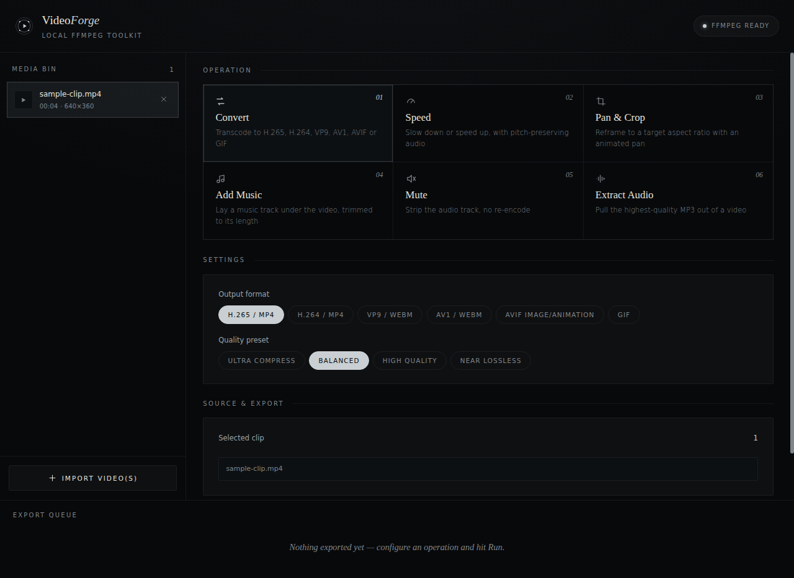
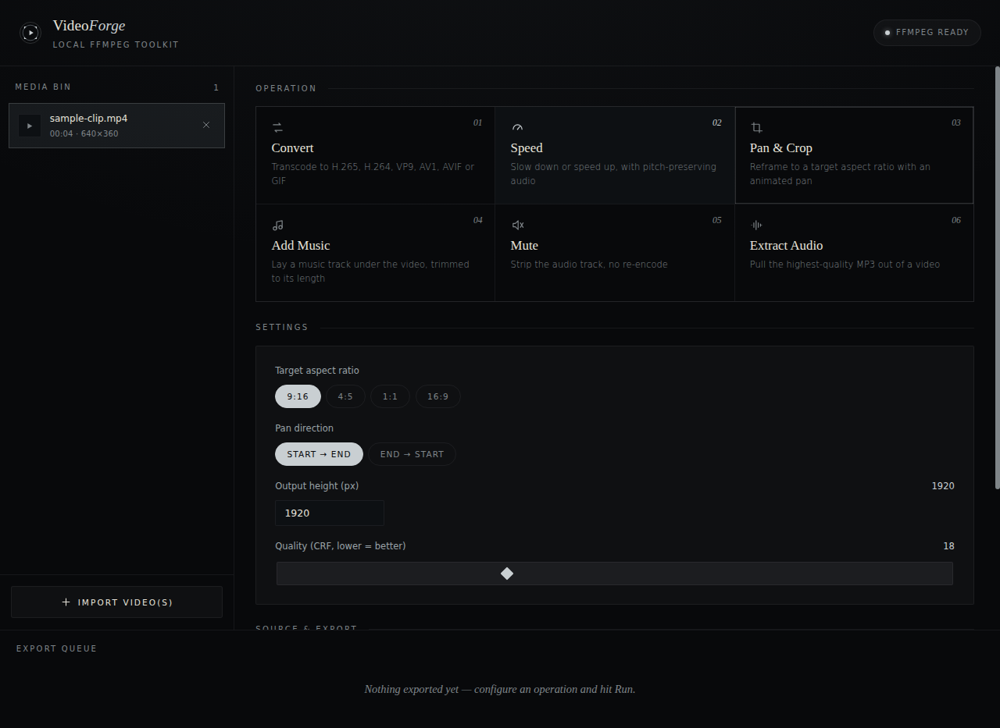
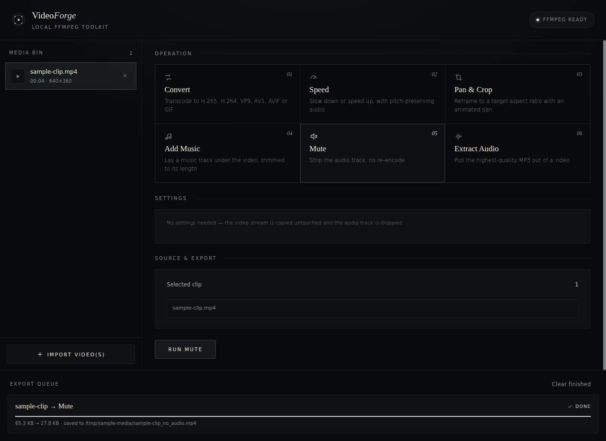

<div align="center">


<br/>


<br/><br/>

### Six things people export ffmpeg one-liners for, in one window.

Convert, speed-ramp, crop-and-pan, mute, score, or extract audio — without memorizing a single flag, and without a single frame of your footage ever leaving your machine.

<br/>

<a href="#-quick-start"></a>
<a href="#-what-it-does"></a>
<a href="#-architecture"></a>
<a href="#-scripts"></a>

</div>

<br/>

## Contents

- [Why local](#why-local)
- [What It Does](#-what-it-does)
- [Quick Start](#-quick-start)
- [Requirements](#-requirements)
- [Architecture](#-architecture)
- [Project Structure](#-project-structure)
- [Scripts](#-scripts)
- [Change Speed, in Detail](#-change-speed-in-detail)
- [Production Build](#-production-build)
- [Design System](#-design-system)
- [Roadmap](#-roadmap-to-public-production)
- [License](#-license)

<br/>

## Why local

Every operation here has a web app that does the same thing — for a price. You upload your footage to someone else's server, wait in a queue, and hope the free tier doesn't watermark it. VideoForge skips all of that: **your video never leaves your disk.** ffmpeg does the work on your own CPU, in your own filesystem, with no account, no upload progress bar, and no limit on file size or minutes per month.

<br/>

## ✦ What It Does

Pick a clip. Pick an operation. The right controls appear — nothing else.

<table>
<tr>
<td width="60" align="center"></td>
<td><strong>Convert</strong><br/><sub>H.265, H.264, VP9, AV1, AVIF, or GIF — four quality presets from "ultra compress" to "near lossless," so you pick an outcome, not a CRF number.</sub></td>
</tr>
<tr>
<td align="center"></td>
<td><strong>Speed</strong><br/><sub>5% to 1000%, by slider, preset, or exact percentage. Pitch stays natural by default — no chipmunk voice at 2×.</sub></td>
</tr>
<tr>
<td align="center"></td>
<td><strong>Pan &amp; Crop</strong><br/><sub>Reframe to 9:16, 4:5, 1:1, 16:9, or a custom ratio — with a slow animated pan across the leftover frame instead of a dead, static crop.</sub></td>
</tr>
<tr>
<td align="center"></td>
<td><strong>Add Music</strong><br/><sub>Drop a track under a clip. It's trimmed or silence-padded to the exact frame automatically — no timeline math.</sub></td>
</tr>
<tr>
<td align="center"></td>
<td><strong>Mute</strong><br/><sub>A stream copy, not a re-encode — audio gone, video untouched, done in under a second.</sub></td>
</tr>
<tr>
<td align="center"></td>
<td><strong>Extract Audio</strong><br/><sub>The cleanest MP3 ffmpeg can pull from a video, at whatever bitrate you need, mono or stereo.</sub></td>
</tr>
</table>

Every operation runs in **batch** — select ten clips, pick one destination folder, and ten correctly-named outputs come out the other side. (Add Music is the one exception: it needs exactly one video and one track, by nature.)

<br/>


<p align="center"><sub>Import a clip and its real duration, resolution, and audio presence show up immediately — read straight off <code>ffprobe</code>, not guessed.</sub></p>

<br/>

<table>
<tr>
<td width="50%">

<p align="center"><sub>Slider, presets, or an exact number — whichever's faster for you.</sub></p>
</td>
<td width="50%">

<p align="center"><sub>Pick a ratio, pick a direction, done.</sub></p>
</td>
</tr>
</table>

<br/>


<p align="center"><sub>This is a real export, not a mockup — a 65KB test clip muted down to 28KB, with the actual output path shown underneath.</sub></p>

<br/>

## 🚀 Quick Start

```bash
npm install
npm run dev
```

A window opens on its own. That's the app — not a browser tab. If you're tempted to check `localhost:5173` in Chrome instead: don't. That address is just how Vite talks to the Electron window internally; opening it yourself gets you the interface with none of the filesystem or ffmpeg access wired in, since only the Electron window has that bridge attached.

<br/>

## 📋 Requirements

| Requirement | Notes |
|---|---|
| **Node.js** | 18+ |
| **ffmpeg** + **ffprobe** | On your `PATH` — the header's status pill tells you immediately if either is missing |

<details>
<summary><strong>Installing ffmpeg</strong></summary>

<br/>

| OS | Command |
|---|---|
| macOS | `brew install ffmpeg` |
| Ubuntu / Debian | `sudo apt install ffmpeg` |
| Windows | `winget install ffmpeg` |

</details>

<br/>

## ⬡ Architecture


The interface never touches your disk directly — `contextIsolation` and `sandbox` are both on. Every request crosses through one typed bridge, `window.api`, and on the other side, each concern has exactly one owner:

| Concern | Owner | Why it's singular |
|---|---|---|
| **Naming an output file** | `OutputResolver` | One "Save As" dialog and one batch-export-to-folder flow, both resolving through the same collision-safe naming rule — never two conventions fighting each other. |
| **Running ffmpeg** | `JobQueueManager` | Caps concurrency at 2 jobs, queues the rest, owns cancellation, and is the only thing in the app allowed to emit progress. |
| **Building ffmpeg arguments** | One `FfmpegJob` subclass per operation | A 7th operation means one new class implementing `buildArgs()` — everything else in the app stays exactly as it is. |

<br/>

## 🗂 Project Structure

```
src/
├─ shared/                    # The one contract both processes agree on
│  ├─ types.ts                  Every IPC payload, fully typed
│  └─ operationCatalog.ts       Operation metadata: title, suffix, extension, batch support
│
├─ main/                      # Node process — the only code touching
│  │                          # fs, child_process, or native dialogs
│  ├─ main.ts                   Thin IPC layer, wires dialogs to services
│  ├─ preload.ts                contextBridge — the only surface the UI sees
│  ├─ ffmpeg/
│  │  ├─ FfmpegJob.ts            Abstract base: spawn, parse -progress, resolve
│  │  ├─ ConvertVideoJob.ts   ┐
│  │  ├─ ExtractAudioJob.ts   │  One class per operation, each ported 1:1
│  │  ├─ MuteVideoJob.ts      │  from real ffmpeg command-line usage
│  │  ├─ PanCropJob.ts        │
│  │  ├─ MergeMusicJob.ts     │
│  │  ├─ ChangeSpeedJob.ts    ┘  atempo-chained, pitch-preserving speed control
│  │  ├─ JobFactory.ts          Maps an operation kind → its Job class
│  │  └─ probe.ts               ffprobe wrapper
│  └─ services/
│     ├─ OutputResolver.ts      The one place output paths get decided
│     └─ JobQueueManager.ts     The one place ffmpeg jobs get run
│
└─ renderer/                  # React UI — talks to window.api, nothing else
   ├─ state/
   │  ├─ Store.ts                Small observable-snapshot base class
   │  ├─ ClipLibrary.ts          Imported clips + selection, one source of truth
   │  └─ JobQueueStore.ts        Mirrors JobQueueManager on the UI side
   └─ components/
      ├─ ClipBin.tsx             Left — import, list, select
      ├─ OperationPanel.tsx      Center — pick an operation, configure, run
      └─ JobQueue.tsx            Bottom — live progress, cancel, results
```

<br/>

## ⌘ Scripts

| Command | What it does |
|---|---|
| `npm run dev` | The full dev app — Vite, a backend TypeScript watcher, and the Electron window, together |
| `npm run build` | Production build of the renderer bundle and the compiled main/preload process |
| `npm start` | Runs the production build |
| `npm run package` | Builds platform installers via `electron-builder`, fetched on demand |

<br/>

## 🐇 Change Speed, in Detail

The playback-rate control is a percent slider (10%–400%) with quick presets and an exact-value field — hand it `1x`, `2x`, `10%`, `80%`, whatever's fastest to type.

- **Video** — `setpts=(1/rate)*PTS` scales presentation timestamps directly.
- **Audio, pitch-preserved** *(default)* — ffmpeg's `atempo` filter only accepts 0.5–2.0 per stage, so anything outside that range is reached by **chaining multiple `atempo` stages** that multiply out to the target rate (4× becomes `atempo=2.0,atempo=2.0`) — the standard way past ffmpeg's single-stage ceiling without pitch artifacts.
- **Audio, pitch not preserved** *(toggle)* — `asetrate` + `aresample`, for the classic tape speed-up/slow-down effect.

<br/>

## 📦 Production Build

```bash
npm run build
npm run package
```

> **Why `electron-builder` isn't a listed dependency:** every current Electron packaging tool — `electron-builder`, and even the officially-recommended `@electron-forge/cli` — pulls in old transitive packages through `@electron/get` internals that haven't been modernized upstream. Since a packager is only needed when cutting an installer, it's fetched on demand via `npx` the moment `npm run package` actually runs — keeping `npm install` itself at zero deprecation warnings.

<br/>

## 🎨 Design System

VideoForge's palette, type, radius, and motion are pulled directly from **[hassanireza.github.io](https://hassanireza.github.io)**'s real design tokens — not a generic dark theme with a new coat of paint.

| Token | Value | Source |
|---|---|---|
| Background | `#08090b` / `#0d1013` / `#12161a` | Exact `--bg` / `--bg-2` / `--bg-3` |
| Text | `#e6e3da` / `#9aa3a8` / `#7f8589` | Exact `--text` / `--text-2` / `--text-3` |
| Accent | `#7c8891` → `#c9cfd2` on hover | Exact `--accent` / `--accent-bright` |
| Display type | Cormorant Garamond, italic for emphasis | Exact `--font-display` |
| Body type | Jost, uppercase + wide tracking for labels | Exact `--font-body` |
| Radius | 2–3px on cards and buttons; 99px reserved only for floating chrome | Same "sharp everywhere, pill only for chrome" rule |
| Borders | Hairline `rgba(214,219,222,.07)`, brightening to `.18` on hover | Same opacity-only border system |
| Buttons | Idle outline → hover inverts to solid, letter-spacing widens | Same motion as the source site's `.submit-btn` |

A few identity details carried over on purpose: the wordmark splits roman + italic serif (`Video` / *Forge*) the way the source splits a first and last name; operation cards are numbered with `counter(op, decimal-leading-zero)`, the same technique behind their project cards; the six-operation grid uses a 1px hairline-as-grid-gap trick straight out of their palette and mark-grid diagrams.

<br/>

## 🗺 Roadmap to Public Production

This is a correctly-architected local tool. Taking it further than your own machine would still want:

- [ ] Code signing & auto-update (`electron-builder` supports both — needs your signing certs)
- [ ] Bundling ffmpeg itself (`ffmpeg-static`) instead of requiring it on `PATH`
- [ ] Automated tests — the ffmpeg argument-building logic in each `*Job.ts` is pure and easy to unit test
- [ ] Real thumbnail generation in the media bin (currently a placeholder icon)
- [ ] Crash/telemetry reporting

<br/>

## 📄 License

Released under the [MIT License](LICENSE).

<div align="center">
<br/>

<br/>
<sub>Built with ffmpeg, Electron, React, and TypeScript.</sub>
</div>
