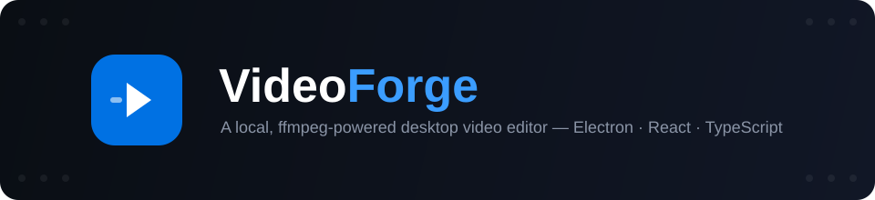
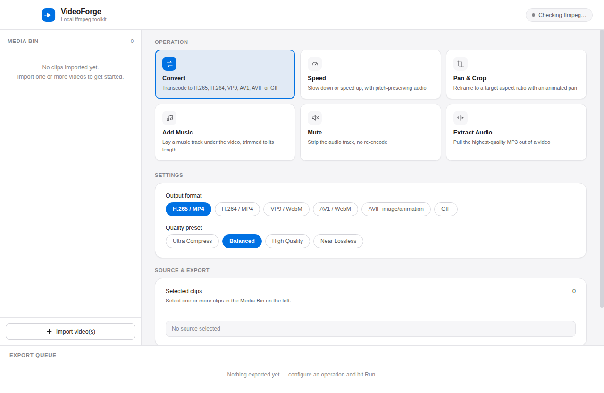
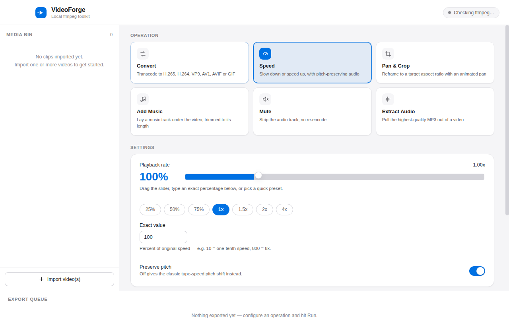
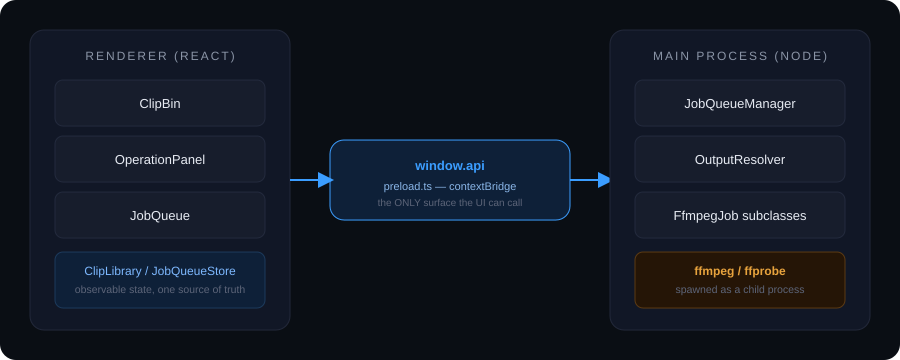

<div align="center">



<br/>

<!-- badges -->


<br/><br/>

**A local, private, ffmpeg-powered desktop video editor.**
No uploads, no accounts, no cloud rendering — your files never leave your machine.

<br/>

<a href="#-quick-start">
  
</a>
<a href="#-features">
  
</a>
<a href="#-architecture">
  
</a>
<a href="#-scripts">
  
</a>

</div>

<br/>

## Contents

- [Screenshots](#-screenshots)
- [Features](#-features)
- [Quick Start](#-quick-start)
- [Requirements](#-requirements)
- [Architecture](#-architecture)
- [Project Structure](#-project-structure)
- [Scripts](#-scripts)
- [Change Speed, in detail](#-change-speed-in-detail)
- [Production Build](#-production-build)
- [Design System](#-design-system)
- [Roadmap to Public Production](#-roadmap-to-public-production)
- [License](#-license)

<br/>

## 📸 Screenshots

<table>
<tr>
<td width="50%">

<p align="center"><sub>Six operations, one consistent card grid — pick an operation, its settings appear below.</sub></p>
</td>
<td width="50%">

<p align="center"><sub>The new Speed operation — percent slider, quick presets, exact value, pitch-preserve toggle.</sub></p>
</td>
</tr>
</table>

<br/>

## ✦ Features

<table>
<tr>
<td width="60" align="center"></td>
<td><strong>Convert</strong><br/><sub>Transcode to H.265, H.264, VP9, AV1, AVIF, or GIF — four quality presets from "ultra compress" to "near lossless."</sub></td>
</tr>
<tr>
<td align="center"></td>
<td><strong>Speed</strong><br/><sub>Slow down or speed up anywhere from 5% to 1000%, via a slider, quick presets (0.25×–4×), or an exact percentage. Pitch-preserving by default.</sub></td>
</tr>
<tr>
<td align="center"></td>
<td><strong>Pan &amp; Crop</strong><br/><sub>Reframe to any aspect ratio (9:16, 4:5, 1:1, 16:9, or custom) with an animated pan across the leftover frame instead of a static crop.</sub></td>
</tr>
<tr>
<td align="center"></td>
<td><strong>Add Music</strong><br/><sub>Lay a track under a video, automatically trimmed or silence-padded to match its exact length.</sub></td>
</tr>
<tr>
<td align="center"></td>
<td><strong>Mute</strong><br/><sub>Strip the audio track with a stream copy — no re-encode, no quality loss, near-instant.</sub></td>
</tr>
<tr>
<td align="center"></td>
<td><strong>Extract Audio</strong><br/><sub>Pull the highest-quality MP3 out of any video, with selectable bitrate and mono downmix.</sub></td>
</tr>
</table>

Every operation supports **batch mode** (except Add Music, which inherently needs one video + one track): select multiple clips, pick a destination folder once, and every output is named automatically with collision-safe suffixes.

<br/>

## 🚀 Quick Start

```bash
# 1. Install dependencies
npm install

# 2. Launch the app (opens its own window — not a browser tab)
npm run dev
```

That's it. A desktop window titled **VideoForge** opens on its own. Don't visit `localhost:5173` in a browser — that's just the internal dev server; opening it directly gives you the UI with none of the filesystem/ffmpeg access, since only the Electron window has the bridge wired in.

<br/>

## 📋 Requirements

| Requirement | Notes |
|---|---|
| **Node.js** | 18+ recommended |
| **ffmpeg** + **ffprobe** | Must be on your `PATH` — the app checks on launch and shows a status dot in the header |

<details>
<summary><strong>Installing ffmpeg</strong></summary>

<br/>

| OS | Command |
|---|---|
| macOS | `brew install ffmpeg` |
| Ubuntu / Debian | `sudo apt install ffmpeg` |
| Windows | `winget install ffmpeg` |

</details>

<br/>

## ⬡ Architecture



The renderer (React) **never** touches the filesystem or spawns processes directly — `contextIsolation` and `sandbox` are both on. Everything crosses through a single typed bridge, `window.api`, exposed by `preload.ts`. On the other side, the main process has exactly one authority for each concern:

| Concern | Owner | Why it's centralized |
|---|---|---|
| **Naming output files** | `OutputResolver` | Single-file "Save As" and multi-clip "export to folder" both resolve through the same collision-safe naming policy — no operation invents its own suffix convention. |
| **Running ffmpeg** | `JobQueueManager` | Caps concurrency (2 jobs at once, tunable), queues the rest, owns cancellation, emits the only progress/done events in the app. |
| **ffmpeg argument-building** | `FfmpegJob` subclasses | One class per operation (`ConvertVideoJob`, `ChangeSpeedJob`, `PanCropJob`, …), each implementing just `buildArgs()`. Adding a 7th operation means adding one class + one catalog entry — nothing else changes. |

<br/>

## 🗂 Project Structure

```
src/
├─ shared/                    # The ONE contract both processes import
│  ├─ types.ts                  Every IPC payload, typed
│  └─ operationCatalog.ts       Operation metadata (title, suffix, ext, batch support)
│
├─ main/                      # Node process — the only code that touches
│  │                          # fs, child_process, or native dialogs
│  ├─ main.ts                   Thin IPC layer, wires dialogs + services
│  ├─ preload.ts                contextBridge — the only surface the UI sees
│  ├─ ffmpeg/
│  │  ├─ FfmpegJob.ts            Abstract base: spawn, parse -progress, resolve
│  │  ├─ ConvertVideoJob.ts   ┐
│  │  ├─ ExtractAudioJob.ts   │  One class per operation, each ported 1:1
│  │  ├─ MuteVideoJob.ts      │  from the original ffmpeg command-line logic
│  │  ├─ PanCropJob.ts        │
│  │  ├─ MergeMusicJob.ts     │
│  │  ├─ ChangeSpeedJob.ts    ┘  atempo-chained, pitch-preserving speed control
│  │  ├─ JobFactory.ts          Maps an operation kind → its Job class
│  │  └─ probe.ts               ffprobe wrapper
│  └─ services/
│     ├─ OutputResolver.ts      The ONLY place output paths are decided
│     └─ JobQueueManager.ts     The ONLY place ffmpeg jobs are run
│
└─ renderer/                  # React UI — talks to window.api only
   ├─ state/
   │  ├─ Store.ts                Tiny observable-snapshot base class
   │  ├─ ClipLibrary.ts          Imported clips + selection, single source of truth
   │  └─ JobQueueStore.ts        Mirrors JobQueueManager on the UI side
   └─ components/
      ├─ ClipBin.tsx             Left panel — import, list, select clips
      ├─ OperationPanel.tsx      Center — operation picker + settings + run
      └─ JobQueue.tsx            Bottom — live queue, progress, cancel, results
```

<br/>

## ⌘ Scripts

| Command | What it does |
|---|---|
| `npm run dev` | Launches the full dev app — Vite, a TypeScript watcher for the backend, and the Electron window, together |
| `npm run build` | Production build of both the renderer bundle and the compiled main/preload process |
| `npm start` | Runs the production build (`npm run build` first) |
| `npm run package` | Builds platform installers via `electron-builder`, fetched on demand with `npx` |

<br/>

## 🐇 Change Speed, in detail

The playback-rate UI is a percent slider (10%–400%) with presets and an exact-number field — feed it `1x`, `2x`, `10%`, `80%`, whatever's easiest.

- **Video** — `setpts=(1/rate)*PTS` scales presentation timestamps directly.
- **Audio, pitch-preserved** *(default)* — ffmpeg's `atempo` filter only accepts 0.5–2.0 per stage, so rates outside that range are reached by **chaining multiple `atempo` stages** that multiply out to the requested rate (e.g. 4× = `atempo=2.0,atempo=2.0`) — the standard way to go beyond ffmpeg's single-stage limit without pitch artifacts.
- **Audio, pitch not preserved** *(toggle)* — `asetrate` + `aresample`, giving the classic tape speed-up/slow-down effect.

<br/>

## 📦 Production Build

```bash
npm run build       # compiles main + preload, builds the renderer
npm run package      # builds installers via electron-builder (fetched on demand)
```

> **Why `electron-builder` isn't a direct dependency:** every current Electron packaging tool — `electron-builder`, and even the officially-recommended `@electron-forge/cli` — pulls in a handful of old transitive packages via `@electron/get` internals that haven't been modernized upstream. Since you only need a packager when cutting an installer, it's fetched on demand via `npx` only when `npm run package` runs, keeping `npm install` itself at zero deprecation warnings.

<br/>

## 🎨 Design System

One neutral scale, one accent color, one typeface. Every color pair clears **WCAG AA** (4.5:1 for body text, 3:1 for large/UI text) — see the token comments at the top of `src/renderer/styles/global.css` for the full contrast rationale.

<br/>

## 🗺 Roadmap to Public Production

This is a correctly-architected local tool, but shipping it *beyond your own machine* would still want:

- [ ] Code signing & auto-update (`electron-builder` supports both — needs your signing certs)
- [ ] Bundling ffmpeg itself (e.g. `ffmpeg-static`) instead of requiring it on `PATH`
- [ ] Automated tests — the ffmpeg argument-building logic in each `*Job.ts` is pure and easy to unit test
- [ ] Real thumbnail generation in the media bin (currently a placeholder icon)
- [ ] Crash/telemetry reporting

<br/>

## 📄 License

Released under the [MIT License](LICENSE).

<div align="center">
<br/>

<br/>
<sub>Built with ffmpeg, Electron, React, and TypeScript.</sub>
</div>
